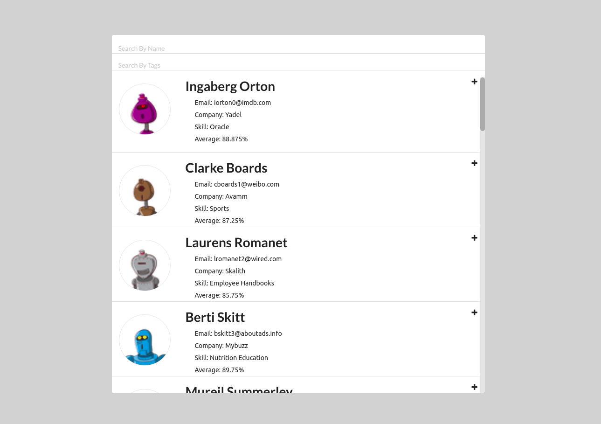
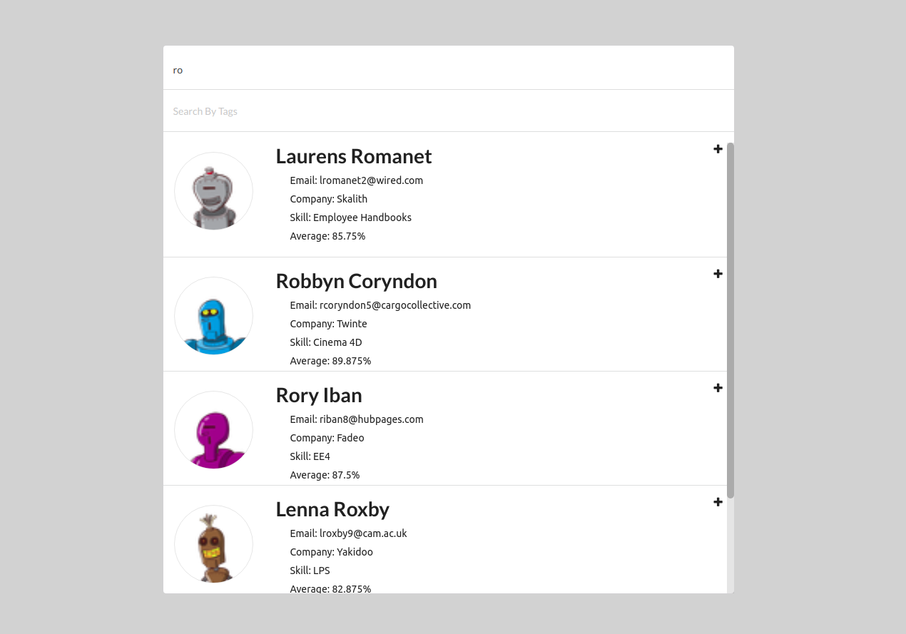
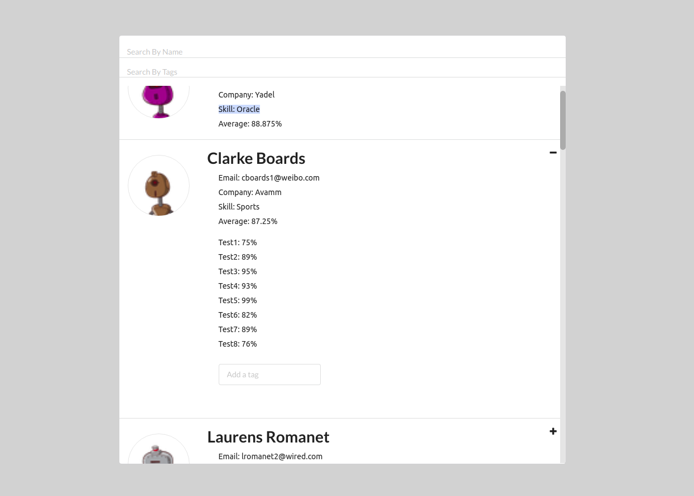
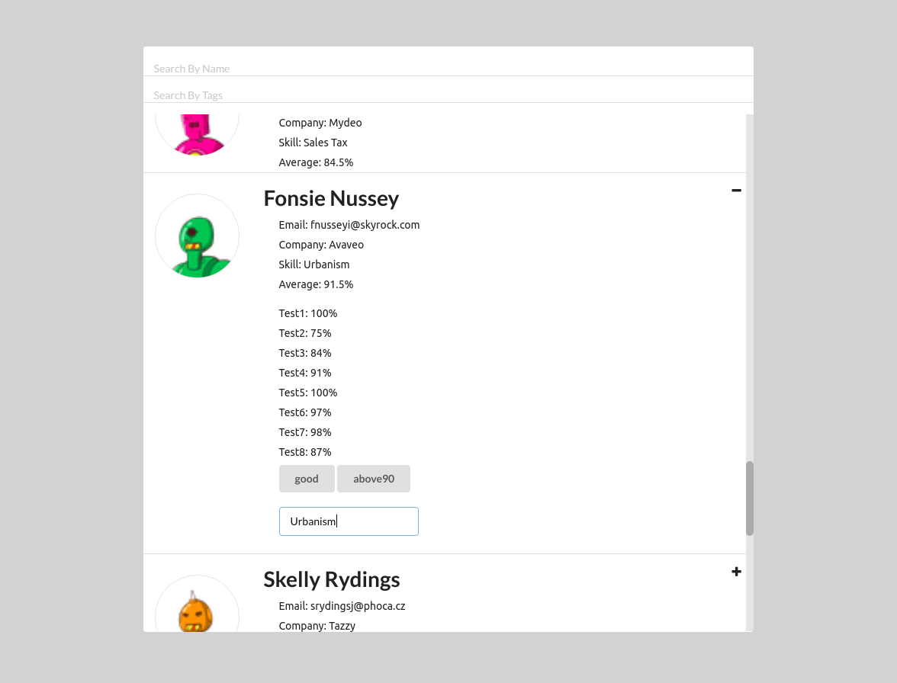
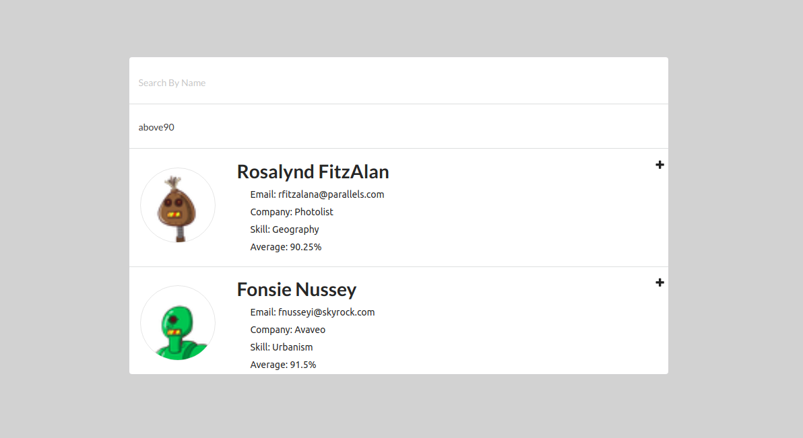

This application shows a list if student profiles with profile data fetched from XXXX api. Users can add custom tags to students in the expanded view toggled by hitting the plus icon.Users can also search by name and the added tags of the students using the search bars at the top.

This project was bootstrapped with [Create React App](https://github.com/facebook/create-react-app).

With nodejs pre-installed, to install the dependencies, simply type the following commands:

    npm install -g create-react-app
    npm install axios

To start the application, copy src and public to the project directory, and then run:

    npm start

P.S. The name and address of the external api are removed at request.

Default view of student profiles:

Filter by student name:

Expanded view of student grades:

Add custom tags to student profile:

Filter by custom tags:

